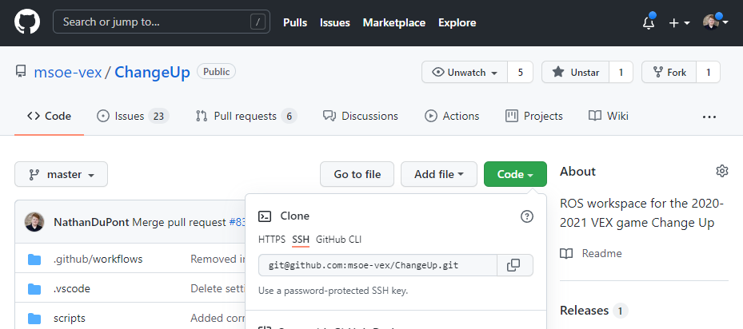

.. This document goes over the git clone command and how it's used

git clone
=========

``git clone`` is one of the first Git commands that you will use. All of our code exists on remote repositories - stored on Git servers held by providers such as GitHub. 

If we want to work on our code, we need to pull a copy of it to our machine, so we can actually edit the files. To do this, we use the ``git clone`` command.

The command is run by typing ``git clone [REPOSITORY]``, where "[REPOSITORY]" is the HTTPS or SSH link to your actual repository. This can be obtained on our GitHub, under the green "Code" button found when looking at a repository:

We **highly recommend** using SSH to clone all of our repositories. If you followed our previous guide to set up SSH on your computer, **this is the option you want to copy from**. Copy the address shown in the text box in the dropdown, in this case being ``git@github.com:msoe-vex/ChangeUp.git``. This can be quick copied by hitting the two squares to the right of the box.

With this copied, run the following command with the link you copied. For example, if you want to clone our **ChangeUp** repository using the SSH link from above, run the following command:

.. code:: bash

    git clone git@github.com:msoe-vex/ChangeUp.git

This will make a *clone* of all the code from this repository into a folder with the name of the repository. For instance, cloning the ChangeUp repository in your ``Documents`` folder will create a separate folder called ``ChangeUp``, located in your ``Documents`` folder. We recommend having a folder to store GitHub repositories, or cloning them into a location that you can easily find them.

Command Usage
-------------

.. code:: bash

    git clone [ARGUMENT] [REPOSITORY]

**Required Arguments:**

:[REPOSITORY]:
    Link to the repository you wish to clone 

**Optional Arguments:**

:--recurse-submodules:
    Allows for submodules to be initialized and pulled on repository creation. This is especially helpful for repositories with submodules, such as our ChangeUp repository.