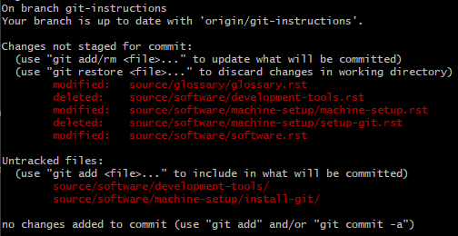

.. This document walks through the git status command

git status
==========
The ``git status`` command can be used to check the status of your local repository, and check it's status compared to a remote repository.

When running this command, you need to be running it from **within the repository you wish to check**. Running ``git status`` in bash (or another terminal) from within a repository will give you a prompt with several helpful pieces of information:

:Current Branch:
    This prompt highlights the current branch that you're on, on the first line

:Branch Status:
    This prompt shows you if your branch is ahead or behind from the branch on the remote server. This is helpful in telling you if you need to push/pull with updates

:Files:
    This prompt shows you which files currently are changed, and which are staged for commit. Files that show up in *green* have been successfully added and have been staged for commit, and files in *red* have yet to be staged.

Command Usage
-------------

.. code:: bash

    git status