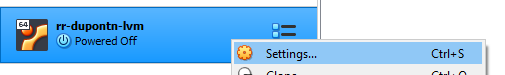
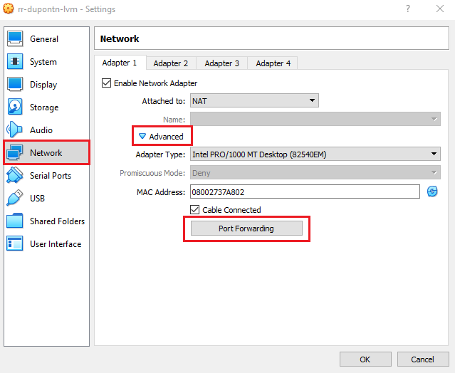
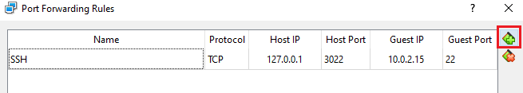

=============================
Installing Visual Studio Code
=============================

Developing in the Linux VM
==========================

This first method of development is the recommended approach for developing using Visual Studio Code - installing VS Code within the Linux VM, and developing within the VM. 

Download and install the Visual Studio Code snap package from *within the VM*:

.. code:: bash

    sudo snap install --classic code

And that's all there is to it! Be sure to see the recommended extensions section of this guide as you will likely want to install some of those.

Developing in Windows
=====================

The second method of developing using Visual Studio Code is using the Remote Development extensions. Using the remote development extensions allows you to work inside the Linux VM through an SSH tunnel between your Windows host and Linux VM.

Long story short, you can run Visual Studio Code on Windows but actually be working inside the Linux VM.

This setup can be faster and have less latency than working directly in the Linux VM when writing code. However, you will still need to open the Linux VM window to work with any GUIs (unless you setup X11 forwarding).

.. warning:: 

    Be sure to pay attention to if commands/actions should be taken on Windows/Linux when following this page
    

Downloading Visual Studio Code
------------------------------

On **Windows**, download and install Visual Studio Code from the `Visual Studio Code download page`_.

Open up Visual Studio Code. We need to install the Remote Development extension pack, which we can do by opening up the extensions tab (keyboard shortcut Ctrl+Shift+X).

Configuring the VM for Remote Access
------------------------------------

Since we want to use our IDE on *Windows* to do work within *Linux*, we need to tell the VM how we plan to communicate with it. 

With the VM powered off, right click on it in the VirtualBox menu and select "Settings".

With settings open, navigate to the "Network" tab on the left, enter the "Advanced" menu, and open the "Port Forwarding" menu.

Inside of this menu, add a new port forwarding rule using the green icon in the top right of the window. From here, fill in the following parameters in the new rule:

:Name:
    SSH

:Protocol:
    TCP

:Host IP:
    127.0.0.1

:Host Port:
    3022

:Guest IP:
    10.0.2.15

:Guest Port:
    22

This will create a rule to allow your machine (the *host*) to communicate with our Virtual Machine (the *guest*) over Port 3022. Port 22 is an operating system reserved port (on most operating systems) dedicated for SSH communication. SSH will eventually allow us to remotely connect to our VM from another computer, but before we get there, we need to configure a few more pieces.

Hit "Ok" on the "Port Forwarding Rules" dialog, which will take you back to the network prompt. From here, select "Adapter 2", and hit "Enable Network Adapter". We need to configure this to allow our device to directly see the Virtual Machine, over a closed network between VirtualBox and our computer.

Select "Host-only Adapter" on the "Attached to:" field, and hit "Ok".

.. image:: images/virtualboxConfigureSecondNetworkAdapter.png
    :alt: Configuring a second (local) network adapter for VirtualBox

Hitting "Ok" will take you back to the VM instance settings, where we have one more change to do. We need to configure the boot settings for our VM, which can be done under the "System" menu on the left.

Under "Boot Order", check "Network" and make sure it's on the bottom of the list. In addition, make sure that "Enable I/O APIC" under "Extended Features" is checked. 

.. image:: images/virtualboxConfigureSystemBoot.png
    :alt: Configuring the boot settings and extended features for the VM

With this configured, you can hit "Ok" to save all of your settings changes. Next, we need to *launch the VM* to finish up the configuration.

Once the VM starts, log in and open a terminal. Type in the following commands to ensure you have the proper tools installed, so the VM can properly receive the SSH connection:

.. code:: bash

    sudo apt-get install openssh-server -y

Once this completes, run the following command to ensure that the SSH agent has started in the VM:

.. code:: bash

    sudo service ssh status

You should see that the agent is "Active" and running. With this, you should have everything set up!

Let's test to make sure everything is working. *Keeping the VM on and open* from the previous step, open up Git Bash on your Windows computer. Run the following command to SSH into your virtual machine from Windows, changing ``[USERNAME]`` to your Linux VM's username:

.. code:: bash

    ssh -p 3022 [USERNAME]@127.0.0.1

This command uses the SSH agent on your *Windows* computer to connect to the SSH agent on the *Linux* VM. Since it's running on our system, we can use the localhost address of `127.0.0.1`. In addition, if you remember from the previous step, we had to configure a custom port to communicate over. In this case, the `-p 3022` tells the SSH client on our machine that we should use Port 3022 on the VM when we want to talk to it.

After running this command, you should be given a password prompt, and after typing your Linux password, you should be in! You can now remotely access your VM from a terminal without needing to directly open the interface.

Setting up SSH Keys
-------------------

Using SSH keys will make it such that we don't need to log in every time we wish to connect to our VM through SSH. Run the following commands in Git Bash on your *Windows* machine to generate a SSH RSA key. Copy it onto your Linux virtual machine. You should only have to replace ``[USERNAME]`` with your Ubuntu account username!

.. code:: bash

    ssh-keygen -t rsa -b 4096 -f "$HOME\.ssh\linux_rsa"
    scp -P 3022 "$HOME/.ssh/linux_rsa.pub" [USERNAME]@127.0.0.1:~/key.pub

On **Linux**, install ssh server (if you didn't in the previous steps)

.. code:: bash

    sudo apt-get install openssh-server

Add the ssh key generated in Windows to the list of authorized keys. This will allow us to connect to our linux virtual machine over ssh without having to type our password every time.

.. code:: bash

    mkdir ~/.ssh
    cat ~/key.pub >> ~/.ssh/authorized_keys
    rm ~/key.pub

If this step fails, you can still connect to your VM by typing the password each time. This is only for convenience.

Visual Studio Code Setup
------------------------

Opening Visual Studio Code on **Windows**, we should see a green icon in the lower left hand corner of the screen. Click on that icon and select ``Open SSH Configuration File..``. If prompted, select the path that looks like ``C:\Users\username\.ssh\config`` and in the file that opens, paste in the following replacing ``[USERNAME]`` with your linux username.

.. code::

    Host lvm
        HostName 127.0.0.1
        Port 3022
        User [USERNAME]
        IdentityFile ~/.ssh/linux_rsa

Once added, save the file and continue.

Click on the green icon again, but this time select ``Connect to Host``, then select ``lvm``. If prompted for the remote machine type, select ``Linux``. 

If everything was set up correctly, you should *not* have to enter your Linux password and should be presented with an empty project screen with a linux command prompt in the terminal view.

If you had issues connecting, change the SSH Configuration in the file above to **not include** the ``IdentityFile`` field, allowing you to enter with your password instead. Repeat trying to connect to the remove VM as described above.

.. _Visual Studio Code Download page: https://code.visualstudio.com/download

Recommended Extensions
======================

Below is a list of some of the packages we recommend installing in Visual Studio Code. 
These extensions can be installed by opening up the extensions tab (keyboard shortcut Ctrl+Shift+X) searching for the package, and clicking install.

General Extensions

* C/C++
* Pylance
* Python
* Visual Studio IntelliCode
