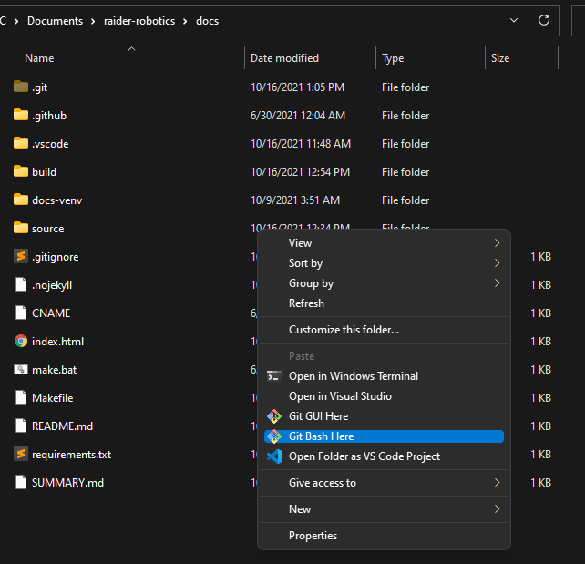

.. This document outlines how to install git on Windows

Installing Git on Windows
=========================

Installing Git on your windows machine will allow you to clone our repositories directly to your main computer, without needing the VM running. While this will work for most repositories, many of our ROS-based repositories (such as ChangeUp) do not currently support running on Windows due to the packages we are using.

Installing the Git Client
-------------------------
The first step of getting Git configured is to install the Git Client for Windows. This can be obtained from `git-scm.com/downloads`__.

__ https://git-scm.com/downloads

From here, you will want to click **"Download for Windows"**, and let the file download. Once downloaded, run the installer. You can click "Next" on **most** of the settings. However, when the installer asks you what editor you want to use by default, we **highly recommend** changing this to a text editor, unless you are comfortable with Vim.

.. image:: images/gitEditor.png
    :alt: Changing the default editor for Git

Once this is changed, continue on, hitting "Next" on all of the pages until the install begins. Only change settings during install if you know what you're changing!

Configuring the Git Client
--------------------------
Search for and run "Git Bash" on your system. You can search for it using ``Windows Key`` + ``S``, and then typing "Git Bash" to open the application.

With Git Bash open, run the following command:

.. code:: bash

    ssh-keygen

This will start the process of generating an SSH key for you, which will allow you to securely work with our GitHub repositories. 

Press enter **three** times in order to create your key. This will create two files - *id_rsa* and *id_rsa.pub* in your ``C:/Users/[USERNAME]/.ssh/`` folder, where "USERNAME" is your Windows account username.

With this file created, we need to copy our *public key* to GitHub, so it knows how to read the data we send it. You can get your key by typing the following:

.. code:: bash

    cat ./.ssh/id_rsa.pub

This should look something like this (this is a fake key - assume your value will be different):

.. image:: images/copyingPublicKey.png
    :alt: Copying the public SSH key that was generated

Copy the part of the key highlighted in the image above, and right click on it. This should cause the highlight to disappear, as right clicking on highlighted text in Bash windows is how you copy it.

Next, in your browser, go to the |Github new SSH key page|.

Paste the key you copied in the previous step into the key box. Enter an appropriate name and add the key to your account, such as "Windows Laptop" or anything else of your choosing.
    
.. |Github new SSH key page| raw:: html

    <a href="https://github.com/settings/ssh/new" target="_blank">Github new SSH key page</a>
    

To create commits, git must know what your name and email is. To tell git who we are, run the following commands (obviously replace with your name / email).

.. code:: bash

    git config --global user.email "[you@example.com]"
    git config --global user.name "[Your Name]"

Using the Git Client
--------------------

With this installed, you can now use the base Git commands from various terminals. When working on Windows, we will primarily be using :term:`Git Bash`. Git Bash can be found by searching for it on Windows:

.. image:: images/gitBashApplication.png
    :alt: Git Bash application in Windows Search

This will open up Git Bash in your ``Users`` folder, which isn't often where we want to be. Instead, a better way to open Bash is by opening the folder you want in File Explorer (such as where you saved your project), right clicking within the folder, and selecting **"Git Bash Here"**:

A final way to access Git is through Visual Studio Code (VSCode). With your project open, you can select the "Terminal" tab on top, and select "New Terminal".

.. image:: images/vscodeNewTerminal.png
    :alt: Opening a new terminal in VSCode

This will open a new terminal window within your project, letting you do all of the main commands we've highlighted above. Your default terminal may be different than shown above - most of the commands should still work in it! If you want to change terminals, or change your default terminal, press the down arrow next to the plus button in the top right:

.. image:: images/vscodeChangeDefault.png
    :alt: Changing default terminal in VSCode

If you want to use Git within your projects, you can now run all of your Git commands from this terminal, without needing a separate window! The commands you can run will be outlined in the Development Tools section.

