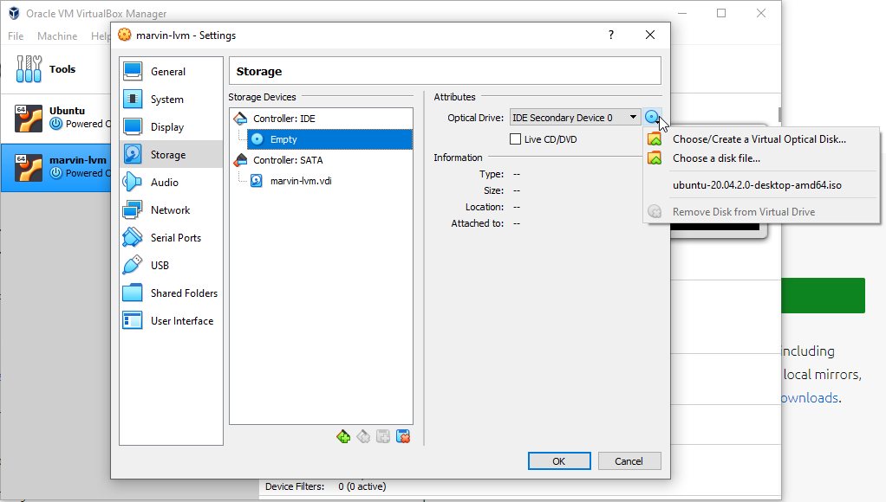
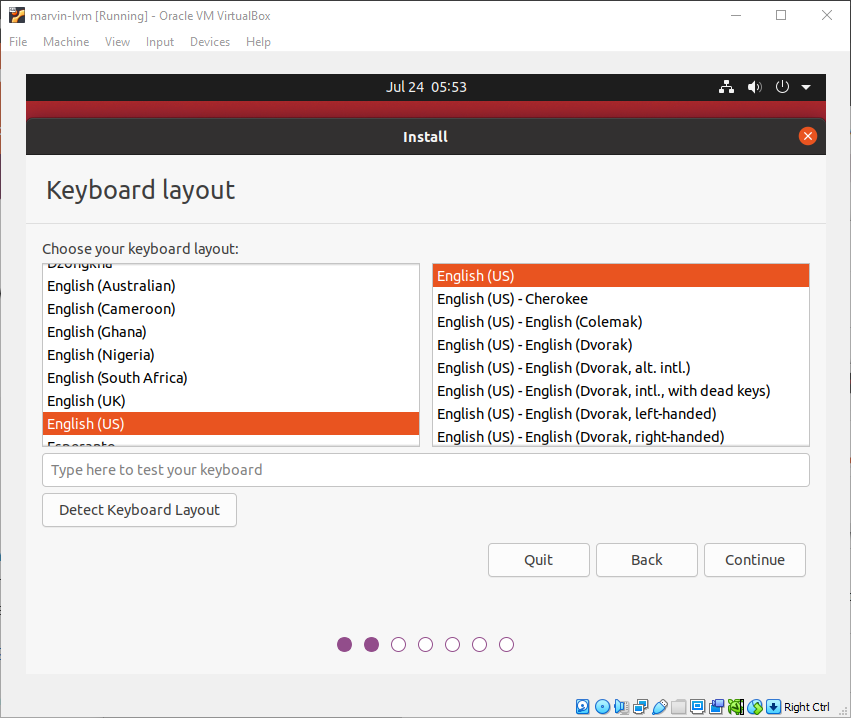
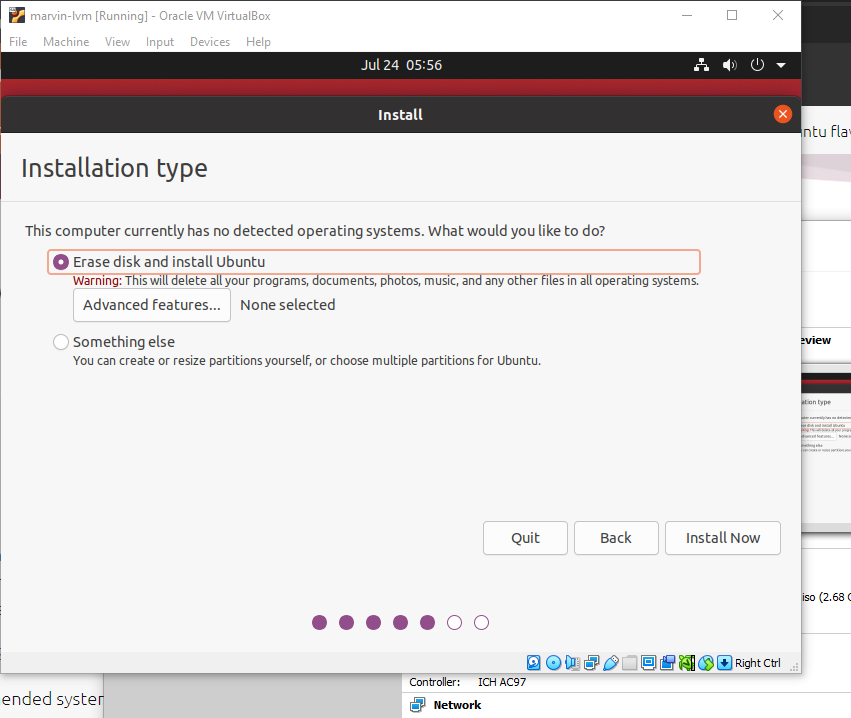

.. This document creates a brief overview of this documentation

Install Linux
=============

Downloading Ubuntu
------------------

Download Ubuntu from the `Ubuntu Website`_. This will be used for our Virtual Machine, so we will just need the *Ubuntu 20.04.3 LTS*.

.. warning::
    
    Ubuntu is roughly a ~2.7GB download. On slow internet, this download can take upwards of an hour

For our development work, we use Ubuntu. In the past, Ubuntu was required to run ROS 1, but with the change to ROS 2, Windows is one of the supported platforms. In the future, we might investigate using Windows as a development platform, but in general Linux is better and easier for development work.

Installing VirtualBox
---------------------

First, install VirtualBox. This can be done through the `VirtualBox Website`_. For a Windows laptop, you'll need to download the *Windows hosts* option. For OS X or Linux, select your respective options and continue with the install.

We recommend using VirtualBox as it is free and available on all platforms. 
Feel free to use VMWare/Hyper-V/Similar, although you will be on your own to figure out guest OS integrations and USB forwarding. 
If you have a spare laptop/desktop, we might suggest doing a full install of Ubuntu alongside your existing OS. Running an OS on bare hardware will always be faster and reliable than a virtualized install. Instructions are not provided for this kind of setup either, although it is easy enough to find tutorials on the web.

Once VirtualBox is downloaded, install it using the default options.

Setting Up a Virtual Machine
----------------------------

In VirtualBox, click ``Machine`` > ``New`` to create a new virtual machine.

.. image:: images/virtualbox1.png
    :alt: Machine settings

It is recommended that you name your virtual machine with your MSOE username, eg ``rr-kempena-lvm``. ``lvm`` stands for Linux Virtual Machine. 

Be sure to select the virtual machine type as ``Linux`` and the version as ``Ubuntu (64-bit)``.

On the next page, select the amount of RAM for the virtual machine to use.

We recommend allocating at least 4GB (4096MB) of RAM. More RAM is nice, although increased amount of RAM is diminishing in returns for our applications as RAM needs to be shared between our host Windows system and the VM.

On the next page, select ``Create a virtual hard disk now``

.. image:: images/virtualbox3.png
    :alt: Virtual hard disk page

On the next page, select ``VDI (VirtualBox Disk Image)``

.. image:: images/virtualbox4.png
    :alt: Image type

Select ``Dynamically allocated`` for the storage type

.. image:: images/virtualbox5.png
    :alt: Storage type

Drag the slider bar to 50 GB. This 50 GB is the maximum space we will allow the virtual disk to expand to. Even the biggest Ubuntu installs are usually limited to 25 GB and our install likely will not exceed 10 GB.

Click create to create the virtual machine.

Once the virtual machine has been created, we need to tweak some of the settings. To do this, right click on the newly created virtual machine and click ``Settings``.

Click on the ``General`` menu, and open the ``Advanced`` tab. Within here, click the dropdown next to ``Shared Clipboard`` and select ``Bidirectional``.

Next, click on the ``Display`` tab and check ``Enable 3D Acceleration``

.. image:: images/virtualbox7.png
    :alt: Display settings

Switch to the ``Storage`` tab and click on ``Empty`` under the ``Controller: IDE`` entry. Then, click on the CD drop down.

Click ``Choose a Disk File``, then navigate to the directory where the Ubuntu 20.04 iso was downloaded to. Select this file and click ``Open``.

Click ``OK`` to save the settings.

Installing Ubuntu
-----------------

Start the virtual machine by right clicking the machine entry, clicking ``Start`` then ``Normal Start``.

If asked which disk to use as the startup disk, select the Ubuntu iso file from before.

After a few minutes (can be up to 5 minutes on a slow computer - black screens are normal), you should be greeted with the Ubuntu desktop and a prompt to install Ubuntu.

Select ``Install Ubuntu``

.. image:: images/ubuntu1.png
    :alt: Ubuntu installer page 1

For keyboard layout, you probably want ``English (US)``. Click ``Continue``.

For the install type, select ``Minimal installation`` and click ``Continue``.

.. image:: images/ubuntu3.png
    :alt: Ubuntu installer page 3

Select ``Erase disk and install Ubuntu``, then click ``Install Now``.

Click ``Continue`` if asked if you want to apply the changes to the disk. On the location page, select your approximate location (probably Chicago).

On the ``Where are you?`` page, select your timezone.

On the ``Who are you?`` page, enter your name. For your computer name, use the same name as you used for the virtual machine name. Use your MSOE username as your username. Choose a password (doesn't have to be secure, just don't forget it!) and select ``Log in automatically`` to skip the login page. Finally, click ``Continue``.

.. image:: images/ubuntu5.png
    :alt: Ubuntu installer page 5

Wait for Ubuntu to install. This can take upwards of 15 minutes depending on how fast your computer and internet connection is.

Once the install process is complete, click ``Restart Now`` to restart the VM.

It will ask you to remove the installation media and click Enter. VirtualBox should have already helpfully removed the virtual Ubuntu install disk so we can just press ``Enter`` to restart the machine.

After a few minutes (be patient, the first startup can take 3+ minutes), you should be greeted with the Ubuntu desktop.

Installing Guest Additions
--------------------------

Without Guest additions installed on Ubuntu, there are a lot of things that aren't quite right. For one, the screen size is tiny, and for another we can't copy paste between the virtual machine and the host.

First, open up the Terminal in Ubuntu. This can be done by clicking the 9 squares in the lower left corner and clicking/searching for ``Terminal``.

Terminal will likely be used frequently when in the Linux terminal. To make it easier to get to, you can right click on the terminal icon and select ``Add To Favorites`` to pin it to the shortcuts bar.

In the terminal, type this command:

.. code:: bash

    sudo apt install gcc make perl

If asked for a ``Y`` to continue, type ``Y`` and press ``Enter``.

This command will install some of the essential build tools needed to compile Guest Additions.

To install Guest Additions, in the VirtualBox window, click ``Devices`` and then ``Insert Guest Additions CD image``.

.. image:: images/guestAdditions1.png
    :alt: Guest additions part 1

After a few seconds, a prompt should appear asking if you would like to automatically run software on the CD. Click ``Run``.

.. image:: images/guestAdditions2.png
    :alt: Guest additions part 2

Enter your password, and click ``Authenticate``.

The installer should automatically run and install the Virtual Box Guest Additions. When the install process finishes, press ``Enter``. Then, restart Ubuntu. This can be done by clicking the power button in the top right corner and clicking ``Power off`` then ``Restart``.

Once Ubuntu restarts, copy paste should work and you should be able to resize the window to whatever size you would like! (If it doesn't, you may have to go under ``View`` and unselect and reselect ``Auto-resize Guest display``)

.. _VirtualBox Website: https://www.virtualbox.org/wiki/Downloads
.. _Ubuntu Website: https://ubuntu.com/download/desktop

Once you've confirmed that the window resizes automatically, shut down the instance (either using the 'Machine' tab > 'ACPI Shutdown', or going to the top right and pressing 'Power Off / Log Out' > 'Power Off...' > 'Power Off')