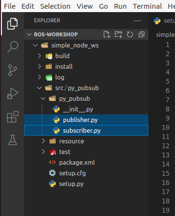

.. This document walks through part two of the ROS workshop, providing guidance on creating a ROS package

Part 2: Creating Nodes
======================

Now that we have some experience with basic nodes, let's create our own!

One of the largest problems with ROS is it's complicated file structure. Packages often contain tons of pieces and configuration files, that allow everything to be linked in and created properly. In order to follow this pattern correctly, we are given multiple utilities to aid in the process.

Creating a ROS Package
----------------------

To create a package, we first want to be in a **workspace**. A workspace is just a folder dedicated to holding multiple ROS packages, and should be a separate folder. This allows for certain commands such as *rosdep* to be defined and run from a specified location.

Run the following commands to create your workspace:

.. code:: bash

    cd /ros-workshop
    mkdir simple_node_ws
    cd simple_node_ws

We are now located in our workspace. From here, we can create our package with the following line:

.. code:: bash

    ros2 pkg create --build-type ament_python py_pubsub

This creates a **Python** ROS Package with the name **py_pubsub**. If you wish to create a different package, or change the name, that can be done in the command by changing the last argument. 

.. note::

    For this workshop, keep the package name as **py_pubsub** as it will make working with the configuration files much easier.

We now can create the code for our different nodes! For this section, we will be providing the code for the base nodes, and modifications can be made to them. To start, create the `publisher.py` and `subscriber.py` files, which can be done by *right-clicking* on the inner "py-pubsub" folder (or whatever package name you chose), selecting `New File`, and adding in the name for the file you want to make.

After running these commands, your file structure should look something like this:

The first file is our *publisher*. It's primary responsibility is to post information to a topic on the network, which other things can then listen to. Copy the following code into the newly created `publisher.py` file.

publisher.py
------------

.. code:: python

    # Package dependencies
    import rclpy
    from rclpy.node import Node
    from std_msgs.msg import String

    # Package code
    class Publisher(Node):
        def __init__(self):
            # Call into the parent node to create the name of this node
            super().__init__('publisher')

            # Create a publisher with an assigned "topic" to send data to
            self.publisher_ = self.create_publisher(String, 'topic', 10)

            # Define how long we want to spend between messages
            timer_period = 0.5  # seconds

            # Call the "create_timer" function from the Node class, which will execute
            # the callback function "timer_callback" every time "timer_period" elapses
            self.timer = self.create_timer(timer_period, self.timer_callback)

            # Initialize the counter to 0
            self.i = 0

        def timer_callback(self):
            # Create a string to hold our message
            msg = String()

            # Populate the message with the string we want
            msg.data = 'Hello World: %d' % self.i

            # Call the publisher in order to send our message to the ROS network
            self.publisher_.publish(msg)

            # Log what we published
            self.get_logger().info('Publishing: "%s"' % msg.data)

            # Increment our instance counter
            self.i += 1

    def main(args=None):
        # Initialize the ROS node
        rclpy.init(args=args)

        # Create a new publisher instance
        publisher = Publisher()

        # "Spin" to update the nodes
        rclpy.spin(publisher)

        # Explicitly destroy the node (similar to a deconstructor - optional here)
        publisher.destroy_node()

        # Shut down the ROS node
        rclpy.shutdown()

    if __name__ == '__main__':
        main()

The second file is our *subscriber*. It's primary responsibility is to listen to messages in the ROS network on a specified topic, and to do something with the data once a new message is received. Copy the following code into the newly created `subscriber.py` file.

subscriber.py
-------------

.. code:: python

    # Project dependencies
    import rclpy
    from rclpy.node import Node
    from std_msgs.msg import String

    # Project code
    class Subscriber(Node):
        def __init__(self):
            # Call the constructor for the parent Node object with the node name
            super().__init__('subscriber')

            # Create a subscription to the topic "topic", linked to our callback
            # function "listener_callback"
            self.subscription = self.create_subscription(
                String,
                'topic',
                self.listener_callback,
                10)

            # Call this to prevent a warning from it "being unused"
            self.subscription

        # Define our callback function
        def listener_callback(self, msg):
            # Log what was received
            self.get_logger().info('I heard: "%s"' % msg.data)

    def main(args=None):
        # Initialize the ROS node
        rclpy.init(args=args)

        # Create a new publisher instance
        minimal_subscriber = Subscriber()

        # "Spin" to update the nodes
        rclpy.spin(minimal_subscriber)

        # Explicitly destroy the node (similar to a deconstructor - optional here)
        minimal_subscriber.destroy_node()

        # Shut down the ROS node
        rclpy.shutdown()

    if __name__ == '__main__':
        main()

Updating our package.xml
------------------------

Now that our files are created, we need to tell ROS what dependencies it needs to load when building and running our projects. For this, we use the `package.xml` file to create notes about these dependencies.

Open the `package.xml` file in VS Code, and edit the following sections:

:<description>:

    Add a description for your package

:<maintainer>:

    Add your email and name as the maintainer

:<license>:

    Add default license information to your package. If unsure of what to choose, enter in `Apache License 2.0`.

With these added, we now need to add in our dependencies. The ROS `package.xml` format allows us to specify different types of dependencies for our project with different tags. For instance, we can use `<exec_depend>[DEPENDENCY]</exec_depend>` tags to specify dependencies that are needed for when we execute our code. We can also use `<test_depend>[DEPENDENCY]</test_depend>` tags to specify test dependencies needed to load the test framework. In this case, `[DEPENDENCY]` would be changed to the package or dependency name you have.

If we look closely in our Python code, we can find a few imports used by our Python programs. These imports are **execution dependencies** and need to be added to our `package.xml`.

.. code:: python

    import rclpy
    from rclpy.node import Node
    from std_msgs.msg import String

Both of our files include dependencies on the *rclpy* package, as well as the *std_msgs* package. Let's add those as **execution dependencies** by adding the following lines after our `<license></license>` tags:

.. code:: xml
    
    <exec_depend>rclpy</exec_depend>
    <exec_depend>std_msgs</exec_depend>

These will tell our ROS program that these packages are needed to run our code.

Adding an Entrypoint
--------------------

Now that we have our dependencies defined, we need to tell our program what to execute. This can be done within the `setup.py` file. The `setup.py` file is used to tell our ROS project *what* to run, and *how* to run it. Open up the `setup.py` file in VSCode.

Change the `maintainer`, `maintainer_email`, `description`, and `license` files to match what you created in the `package.xml` file. 

Next, we need to define our **entrypoints**. This tells ROS how to run our different nodes within the package. Entrypoints need to be added to the following section of code in the file (without the comment):

.. code:: python

    entry_points={
        'console_scripts': [
            # TODO add entrypoints here!
        ],
    },

In place of the `#TODO` comment that we added, we can specify one or more entrypoints for how ROS can run our program. Each entrypoint will be put in as a string, and multiple entrypoints will be separated by commas.

The entrypoint string follows the format below:

.. code:: python

    '[PACKAGE] = [FILE]:[EXECUTABLE]'

:[PACKAGE]:

    This is the name you want ROS to use to launch your node. For example, replacing this with "publisher" will allow ROS to launch the associated code by calling "publisher"

:[FILE]:

    This is the path and file name of the file containing the node. This includes the **path relative to the setup.py script**, but instead of using slashes, periods are used. For example, our "publisher" file can be referenced with `py_pubsub.publisher`

:[EXECUTABLE]:

    This is the function you want to be executed. For us, we always want it to be `main`, as this will trigger our nodes to start properly.

Copy and paste the following configuration lines into where the previous `#TODO` comment was:

.. code:: python

    'publisher = py_pubsub.publisher:main',
    'subscriber = py_pubsub.subscriber:main'

With that, it's now about time to test our node.

Updating Dependencies
---------------------

Right before we start, we want to update the dependencies of our project. This can be done with the `rosdep` command. 

Run the following commands:

.. code:: bash

    cd /ros-workshop/simple_node_ws
    rosdep install -i --from-path py_pubsub --rosdistro $ROS_DISTRO -y

This will check to make sure all dependencies of our packages in the workspace are installed.

With this completed, it's time to test our nodes.

Testing Our Nodes
-----------------

To test our ndoes, we need to build them first. Run the following commands to build our package:

.. code:: bash

    cd /ros-workshop/simple_node_ws
    colcon build --packages-select py_pubsub

This command will use the files we created and build a ROS package with them. This adds in all of the ROS libraries that give us the ability to easily communicate between nodes, along with the remainder of the ROS library.

In order for our terminal to be properly setup with our package, we first need to **source our setup files**. This connects our terminals with all of the libraries and additional components needed by our package to make it run properly. This can be done by running the following command:

.. code:: bash

    cd /ros-workshop/simple_node_ws
    . install/setup.bash

Finally, we can run our nodes with the `ros2 run` command. Use the following command to run our **publisher node**.

.. code:: bash

    ros2 run py_pubsub publisher

With the publisher running, we can also run our **subscriber node** from a separate terminal, with the code below:

.. code:: bash

    ros2 run py_pubsub subscriber

Adding Additional Nodes
-----------------------

With the previously created nodes working, we can add in an additional node to send more data to the network. In this case, let's design a node named  `time_publisher` that publishes the *current datetime* to the topic `topic`.

To do this, create a file called `time_publisher.py` in the same folder as `publisher.py` and `subscriber.py`.

In here, paste the template code located below, and complete the few `#TODO` lines:

.. code:: python

    # Package dependencies
    import rclpy
    from rclpy.node import Node
    from std_msgs.msg import String
    from datetime import datetime # NOTE: We are adding a new dependency to the "datetime" library

    # Package code
    class TimePublisher(Node):
        def __init__(self):
            # Call into the parent node to create the name of this node
            # TODO - Create a node called 'time_publisher' based on the other publisher node

            # Create a publisher with an assigned "topic" to send data to
            self.publisher_ = # TODO - same as the other publisher node

            # Define how long we want to spend between messages
            timer_period = 1

            # Call the "create_timer" function from the Node class, which will execute
            # the callback function "timer_callback" every time "timer_period" elapses
            self.timer = self.create_timer(timer_period, self.timer_callback)

        def timer_callback(self):
            # Create a string to hold our message
            msg = String()

            # Populate the message with the current time
            msg.data = 'Current Time: %s' % datetime.now().strftime("%H:%M:%S")

            # Call the publisher in order to send our message to the ROS network
            # TODO - Publish the message

            # Log what we published
            self.get_logger().info('Publishing: "%s"' % msg.data)

    def main(args=None):
        # Initialize the ROS node
        rclpy.init(args=args)

        # Create a new publisher instance
        # TODO - Create an instance of our new class

        # "Spin" to update the nodes
        # TODO - Spin to update the instance of our new node

        # Explicitly destroy the node (similar to a deconstructor - optional here)
        time_publisher.destroy_node()

        # Shut down the ROS node
        rclpy.shutdown()

    if __name__ == '__main__':
        main()

Before testing, we also need to update our `package.xml` with a new dependency. Within `package.xml`, add **datetime** as an execution dependency.

Finally, we need to define a new entrypoint for our new node. Within `setup.py`, create a new entrypoint under the name `time_publisher`, linking to the `time_publisher.py` file you created previously.

With this done, you should rebuild all of the nodes, source the configuration script (`. install/setup.bash`), and run all three of the nodes!

You should see now that the subscriber is picking up messages from both nodes. Another powerful feature in ROS is the ability to easily connect multiple nodes together - neither of the previous nodes needed to be changed in order to link in this node! In addition, we also can have this node running at a completely different rate than the other nodes (running at 1 second instead of 500 ms), without changing anything outside of the node.